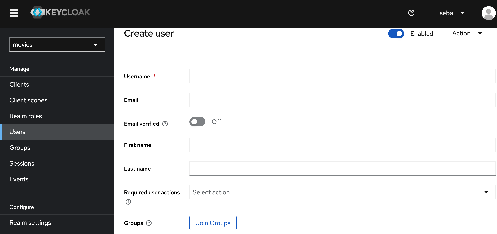
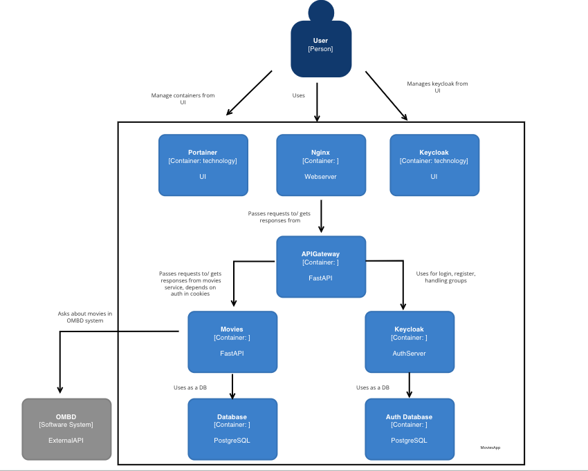

# Architecture Decision record MoviesApp


## Context

MoviesApp is at this moment small but easy to extend app.
The purpose is use this app as backend for movies blog website.
Now app is able to handle basic adding movies by admin from OMBb API . Users are able to add movies to favourites. 
In future there will be option to comment movies and rate it.
For Admin will be option to generate reports with help of another microservice.

## Stack
* FastAPI
* Keycloak
* PostgreSQL
* Docker & Docker-compose
* PyTest
* AWS

## Deployment
App was deployed on AWS ecosystem.

* AWS RDS
* EC2
* ECR

## CI/CD
CI/CD is made on GitLabRunner. Please check another repos to get more info.


## How to start
Clone all repos.

Get OMBD API key from https://www.omdbapi.com/.

Start docker-compose files depending on local or prod mode.
Configure your envs as you wish.

Order:
* database
* movies
* authservice
* apigateway
* portainer
* proxy

To load config for keycloak enter to running container and type:


```
kc.sh import --dir /backup
```
Be careful because it overwrites realms!

To create normal user we can use API or keycloak UI. If we want admin user we need to go to movies realm in keycloak UI, create user and add him to admin group.





## Decision

It was decided to use Microservice application diagram below. 

## Diagram



